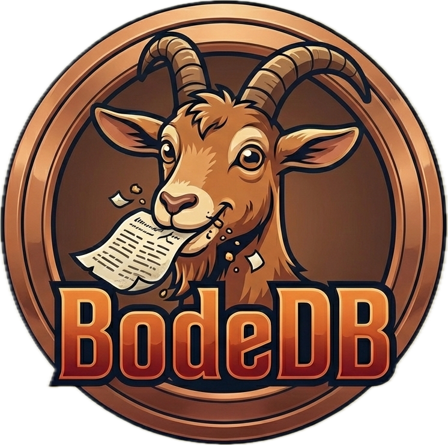

    

<h1>BodeDB</h1>
Lightweight fun purposes key-value distributed database inspired in LevelDB and RocksDB.
Designed for speed and durability it uses an LSM-tree storage engine, SSTables, indexing, compression, filtering using
and Bloom-filter-based querying, along with distributed coordination over RPC.

BodeDB aims to be small, thread-safe and enjoyable to use - it "eats big workloads of data for breakfast" just like the brazilian goat 
that represents it.